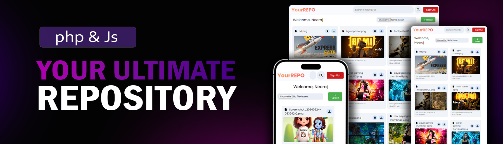

<div align="center">
  <br />
   
  <br />

  <div>
    
    
    
    
    
  </div>


  <h3 align="center">Your Repository</h3>

</div>

## 📋 <a name="table">Table of Contents</a>

1. 🤖 [Introduction](#introduction)
2. ⚙️ [Tech Stack](#tech-stack)
3. 🔋 [Features](#features)
4. 🤸 [Quick Start](#quick-start)
5. 🔗 [Links](#links)

## <a name="introduction">🤖 Introduction</a>

a PHP-based web application designed to provide a secure and efficient platform for uploading, managing, and sharing files. This repository enables users to easily upload files and access them through a user-friendly interface, ensuring a seamless experience for file management.
## <a name="tech-stack">⚙️ Tech Stack</a>

- php
- javascript
- mySql
- html
- css

## <a name="features">🔋 Features</a>

👉 **User Registration**: Allows users to register with a username and password.

👉 **Secure Password Storage**: Utilizes password hashing to securely store user passwords.

👉 **Session Management**: Implements session management for user authentication.

👉 **XSS Attack Prevention**: Includes functions to prevent XSS attacks when handling user input.

👉 **File Upload**: Allows authenticated users to upload files securely.

👉 **Dashboard**: Displays uploaded files in a user-friendly dashboard interface.

👉 **File Download**: Authenticated users can download their uploaded files.

👉 **Responsive**: Ensures seamless functionality and aesthetics across all devices

👉 **User Logout**: Provides an option for users to log out securely.

and many more, including code architecture and reusability

## <a name="quick-start">🤸 Quick Start</a>

Follow these steps to set up the project locally on your machine.

**Prerequisites**

Make sure you have the following installed on your machine:

- [Git](https://git-scm.com/)
- [Xampp](https://www.apachefriends.org/)

**Cloning the Repository**

```bash
git clone git@github.com:Neeraj-gupta2005/php_repository.git
```

**Installation**

Set up a web server environment (e.g., Apache, Nginx) with PHP and MySQL support.

Import the database schema provided in the `table.sql` file to set up the required database tables.

```bash
-- to create table which stores user registration details

CREATE TABLE register (
    id INT(11) NOT NULL AUTO_INCREMENT,
    username VARCHAR(50) NOT NULL,
    email VARCHAR(50) NOT NULL,
    password VARCHAR(120),
    uploads INT(11) DEFAULT 0,
    PRIMARY KEY (id)
);

-- to create table which store the files detail

CREATE TABLE uploaded_files (
    id INT(11) NOT NULL AUTO_INCREMENT,
    filename VARCHAR(255) NOT NULL,
    filesize INT(11) NOT NULL,
    upload_date TIMESTAMP NOT NULL DEFAULT CURRENT_TIMESTAMP,
    user_id INT(11),
    PRIMARY KEY (id),
    FOREIGN KEY (user_id) REFERENCES register(id)
);
```

Open [http://localhost:5173](http://localhost:5173) in your browser to view the project.


## <a name="links">🔗 Links</a>
- [Live Website](https://moder-brainwave.netlify.app/)


For questions, support, or feedback, please contact neerajKgupta33@gmail.com .

Acknowledgements
----------------

This project uses Font Awesome icons for its user interface.
